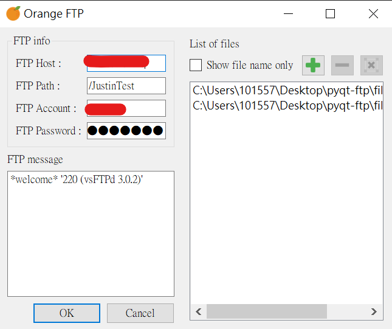
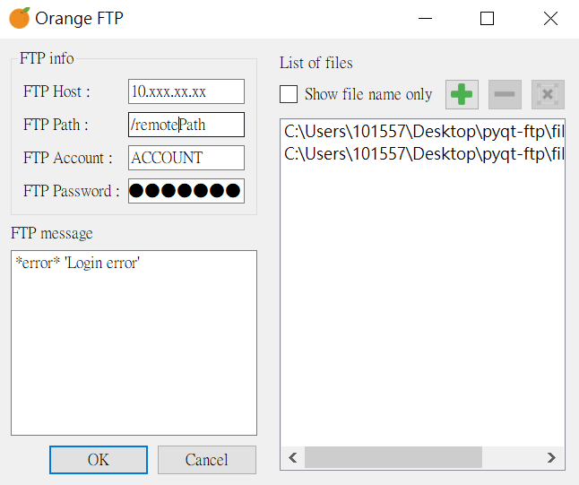
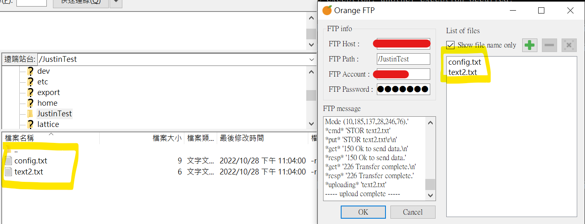

# Orange FTP

Easy FTP application

## Instructions
For sigle .exe in dict:
- Create ```config.txt``` in ```dict/```
```sh 
#config.txt
FTP_IP:xx.xxx.xxx.xx
FTP_Path:/xxx/xxx
FTP_Account:YOUR_ACCONUT
FTP_Password:YOUR_PASSWORD
```
- create ```dict/file``` folder and put your wanna upload file in
- Excute ```OrangeFTP.exe```.

For source code in start.py:
- Create ```config.txt```
```sh 
#config.txt
FTP_IP:xx.xxx.xxx.xx
FTP_Path:/xxx/xxx
FTP_Account:YOUR_ACCONUT
FTP_Password:YOUR_PASSWORD
```
- create ```file``` folder and put your wanna upload file in .
- Excute.
```sh 
python start.py
 ```
## Build
```sh
pyinstaller start.spec
```

## Included packages
- [pyQt5](https://www.riverbankcomputing.com/software/pyqt/) 
PyQt is a set of Python bindings for The Qt Company's Qt application framework and runs on all platforms supported by Qt including Windows, macOS, Linux, iOS and Android. 
- [pyqt-top-left-right-file-list-widget](https://github.com/yjg30737/pyqt-top-left-right-file-list-widget)
Simple PyQt widget which contains QListWidget and add, delete QPushButton to add and delete file in the list
- [pyqt-file-list-widget](https://github.com/yjg30737/pyqt-file-list-widget)
PyQt QListWidget for files (Being able to drop the files based on user-defined extensions)
- [pyftpdlib](https://github.com/giampaolo/pyftpdlib/)
Python FTP server library provides a high-level portable interface to easily write very efficient, scalable and asynchronous FTP servers with Python.

## Demo
Success login in FTP :  


Error login :  


Upload success :  
