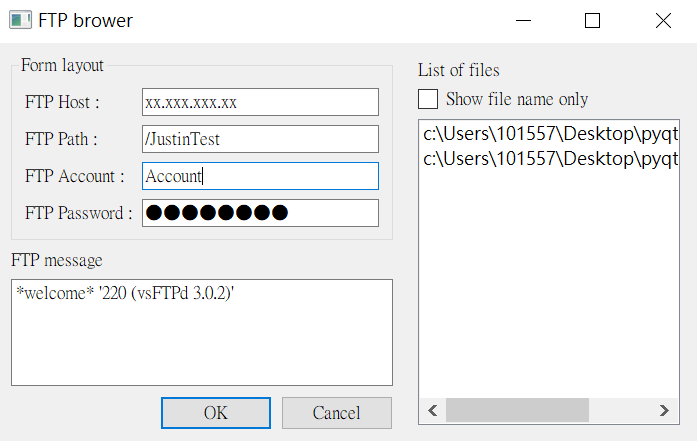

# pyQt5 FTP app

Easy FTP application

## Instructions
- Create ```config.txt```
```sh 
#config.txt
FTP_IP:xx.xxx.xxx.xx
FTP_Path:/xxx/xxx
FTP_Account:YOUR_ACCONUT
FTP_Password:YOUR_PASSWORD
```
- Put your wanna upload file in ```file folder``` .
- Excute ```FTP_app.exe``` or ```python start.py```.
- Check the file in filelist and you can add or delete file.
- Click OK will upload all file in filelist to FTP remote path which your setting.

## Included packages
- [pyqt-top-left-right-file-list-widget](https://github.com/yjg30737/pyqt-top-left-right-file-list-widget)
Simple PyQt widget which contains QListWidget and add, delete QPushButton to add and delete file in the list
- [pyqt-file-list-widget](https://github.com/yjg30737/pyqt-file-list-widget)
PyQt QListWidget for files (Being able to drop the files based on user-defined extensions)
- [pyftpdlib](https://github.com/giampaolo/pyftpdlib/)
Python FTP server library provides a high-level portable interface to easily write very efficient, scalable and asynchronous FTP servers with Python.

## Result
